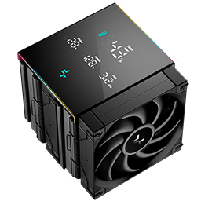

# AK620 Pro Controller for Mac

  
A **única solução** para controlar e atualizar o visor do **AK620 Pro** no **macOS**.

## 🚀 Sobre o Projeto
O **AK620 Pro Mac Controller** permite que usuários de macOS atualizem as informações exibidas no visor do DeepCool AK620 Pro, preenchendo uma lacuna deixada pela fabricante, que não oferece suporte nativo para o sistema da Apple.

## ✨ Recursos
- Exibição da **temperatura da CPU**
- Atualização do **TDP e frequência de operação**
- Informação sobre o **percentual de uso da CPU**
- Interface **leve e responsiva**
- Atualizações automáticas a cada **1 segundo**

## 🖥️ Requisitos
- macOS **Sonoma** ou superior
- DeepCool **AK620 Pro**
- Conexão USB ativa entre o cooler e o Mac
- [Intel Power Gadget](https://intel-power-gadget.macupdate.com/) instalado 

## 📦 Instalação
```sh
# Clone o repositório
$ git clone https://github.com/henriqueccruz/AK620-Pro-Controller-for-Mac.git

# Acesse a pasta do projeto
$ cd AK620-Pro-Controller-for-Mac

# Abra o projeto no XCode e compile
$ open -a Xcode DeepCool.xcodeproj
```

## ⚡ Como Usar
1. **Conecte o AK620 Pro** via USB ao seu Mac.
2. **Inicie o aplicativo**.
3. O visor do cooler será atualizado automaticamente com as informações em tempo real.

## 🛠️ Desenvolvimento
Este projeto foi desenvolvido em **Swift**, com suporte a comunicação USB para captura de dados de hardware. Todo o código é open-source e qualquer contribuição é bem-vinda!

## 🤝 Contribuições
Sinta-se à vontade para abrir **issues** ou enviar **pull requests** para aprimorar o aplicativo.

## 📜 Licença
Este projeto está licenciado sob a **MIT License**.

---
Criado por [Henrique Cruz](https://github.com/henriqueccruz) ❤️
